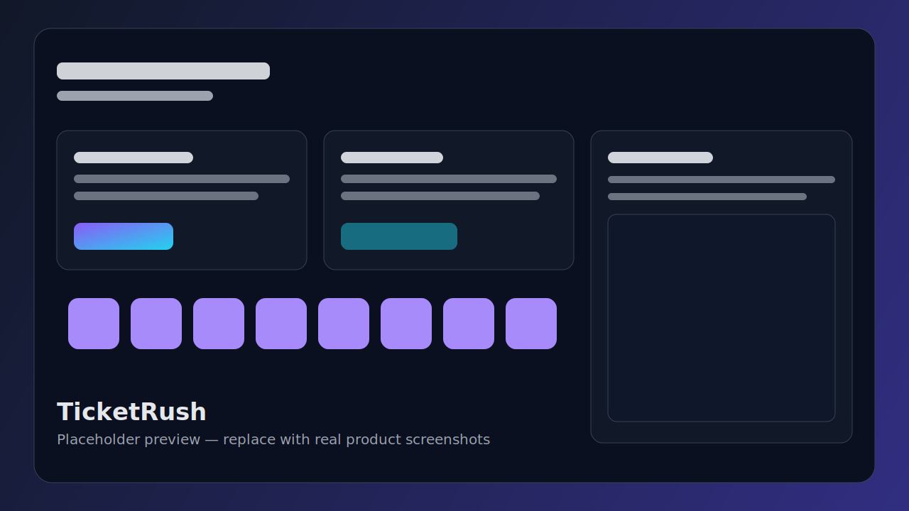

# TicketRush

TicketRush is a full-stack event ticketing platform built with Nuxt 4.
It helps organizers publish events, configure venues and seat maps, handle high-demand sales with a waiting room, and manage check-in workflows from a modern admin console.




## What this project does

TicketRush provides two core experiences:

- **Customer experience**: discover events, enter waiting room, select seats, and complete checkout.
- **Organizer/admin experience**: create and publish events, manage sessions, venues, pricing, users, transactions, and operational tasks.

It includes built-in authentication, role-based admin protections, localization, media uploads, and production-oriented deployment support.

## Core capabilities

- **Event discovery and ticket purchase**
  - Event listing, search, location/city filters
  - Session-specific seat maps and seat holds
  - Checkout lifecycle with success/recovery flows
- **Waiting room and queue control**
  - Queue join/leave/status endpoints
  - Admin controls to admit queue members and release holds
- **Organizer tooling**
  - Event CRUD, publish/unpublish, translations, autosave drafts
  - Session pricing and seat override management
  - Venue management with translation support
- **Admin operations**
  - Dashboard metrics, user management, transactions
  - Task endpoints for operational maintenance
- **Security and account management**
  - Password auth, OAuth, email verification/reset
  - Passkey/WebAuthn support
  - Admin middleware checks for protected routes
- **Platform features**
  - i18n support (Vietnamese and English)
  - PWA assets and offline route
  - Sentry integration and Nuxt Security headers

## Tech stack

- **Frontend**: Nuxt 4, Vue 3, Tailwind CSS v4, shadcn-vue, Reka UI
- **Backend**: Nuxt server routes (Nitro), TypeScript
- **Data layer**: Drizzle ORM with SQLite (NuxtHub D1)
- **Storage**: Cloudflare R2 (NuxtHub blob)
- **State and UX**: Pinia, VueUse
- **Quality**: ESLint, Vitest, TypeScript checks

## Project structure

```text
ticketrush/
├── app/                 # Nuxt app (pages, components, layouts, composables)
├── server/              # API routes, middleware, DB access, server utilities
├── shared/              # Shared constants and route definitions
├── public/              # Static assets and generated PWA assets
├── test/                # Vitest test suites
├── types/               # Project type definitions
└── nuxt.config.ts       # Runtime/build/module configuration
```

## Getting started

### Prerequisites

- Node.js 18+
- npm (or compatible package manager)

### Setup

1. Clone the repository:

```bash
git clone https://github.com/lndmanh/ticketrush.git
cd ticketrush
```

2. Install dependencies:

```bash
npm install
```

3. Create environment file:

```bash
cp .env.example .env
```

4. Generate database artifacts (if needed):

```bash
npm run db:generate
```

5. Start development server:

```bash
npm run dev
```

App runs at `http://localhost:3000` by default.

## Available scripts

- `npm run dev` — start local development server
- `npm run build` — create production build
- `npm run preview` — preview production output
- `npm run lint` — run ESLint
- `npm run test` — run Vitest test suite
- `npm run typecheck` — run TypeScript checks
- `npm run db:generate` — generate DB migrations
- `npm run db:seed` — run admin creation seed task

## Deployment

This project is configured for **NuxtHub + Cloudflare** by default, and can be adapted for other Nuxt-compatible deployment targets.

A default deploy script is available:

```bash
npm run deploy
```

## Contributing

Contributions are welcome. Please open an issue to discuss significant changes before submitting a pull request.

## License

Distributed under the MIT License. See [LICENSE](./LICENSE).
